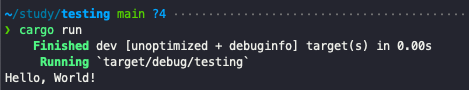
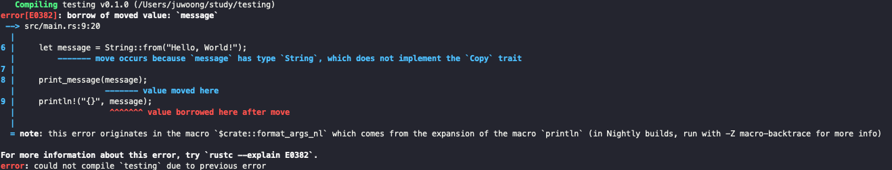
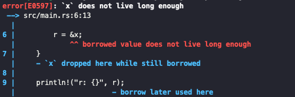

러스트는 속도(개발과 구현된 프로그램의 속도) 그리고 안정성이라는 두가지 토끼를 잡기 위해 구현된 언어입니다. 다양한 언어를 건드려 보신 분들이라면 이러한 두가지 토끼를 잡는 언어는 Sliver Bullet (모든걸 해결하는 도구라는 은유적 표현이며, 주로 Silver bullet은 없다! 로 표현됨) 처럼 허황된 이야기로 들리겠지만, 지금까지의 러스트의 모습을 본다면 이들의 주장대로 이루어지고 있는 듯 합니다.

이러한 빠른 속도와 뛰어난 안정성이라는 두가지 토끼를 잡기 위해, 러스트는 컴파일 타임에 변수의 생성과 종료 시점을 결정할 수 있도록 언어를 설계했습니다. 이러한 설계의 결과물이 바로 러스트의 가장 큰 특성이라고 불리우는 Ownership(소유권)과 Lifetime(생명 주기)이라는 개념입니다. 러스트는 상기된 개념들을 이용해서 컴파일 시점에 변수의 생성과 종료 시점을 파악하고, 이를 통해 dangling pointer처럼 메모리 소유권에 의해 발생되는 문제들을 compile time에 반응할 수 있습니다. 또한 VM 레벨에서 메모리를 추적하여 Garbage Collecting을 실행할 필요도 없게 됩니다.

다만 이러한 개념이 다른 언어를 사용했던 사람들에게는 매우 생소한 개념이기에, 러스트를 처음 사용하려는 사람들에게 큰 허들로 작용하곤 합니다. 이 게시글에서는 해당 개념에 대해 간단하게, 흔히 갖는 오해를 해소해 보고자 합니다.

---

# Ownership

러스트 변수의 Ownership은 다음과 같은 대전제가 있습니다.

1. 각 변수는 모두 `owner` 라는 값을 갖고 있으며
2. 이 값은 한번에 하나의 값만 가질 수 있습니다
3. 만일 `owner` 가 스코프 밖으로 벗어나게 되면, 이 변수의 값은 drop됩니다.

개발자는 코드로 이해하는 법, 코드를 통해 설명해 보도록 하겠습니다. 여기 Hello World를 출력하는 기본적인 예제가 있습니다.

```rust
fn main() {
		let message = String::from("Hello World!");

		println!("{}", message);
}
```

이 코드의 유일한 변수인 `message` 의 Ownership은 바로 위의 스코프인 `main` 함수가 가지고 있습니다. 위 대전제에 의해, 다음과 같이 `message` 는 변할 것입니다.

```rust
fn main() {
    let message = String::from("Hello, World!"); // 변수 생성, owner: main 함수

    println!("{}", message); // 출력
} // main 종료. owner가 종료되었으므로 message는 drop
```

지극히 당연한 코드에, 지극히 당연한 주석이죠? 이처럼, 러스트는 기본적으로는 소유자가 끝나는 시점에, 해당 소유자가 가지고 있던 변수들을 drop합니다. 이 상황에서 조금씩 문제를 만들어 나가 보겠습니다.

해당 코드를 조금 바꿔 보겠습니다. 변수를 출력하는 부분을 새로운 함수로 분리해서 구현해 보겠습니다 .

```rust
fn print_message(message: String) {
    println!("{}", message);
}

fn main() {
    let message = String::from("Hello, World!");

    print_message(message);
}
```

이렇게 하더라도 별 문제는 발생하지 않습니다. 충분히 잘 실행이 됩니다.



이제 message의 소유권을 다시 한번 볼까요?

```rust
fn print_message(message: String) {
    println!("{}", message); // 출력. message의 owner: print_message
} // print_message 종료. message drop

fn main() {
    let message = String::from("Hello, World!"); // 변수 생성, owner: main 함수

    print_message(message); // 소유권 이동 발생 main => print_message
}
```

`message` 의 소유권은 `print_message` 에게로 넘어갔고, `main` 함수보다 `print_message` 가 더 일찍 종료됩니다. 즉, `main` 함수가 종료되기 이전에 `message` 는 drop되게 됩니다. 진짜일까요? 출력 함수 밑에서 다시 `message` 를 출력해 보겠습니다.

```rust
fn print_message(message: String) {
    println!("{}", message);
}

fn main() {
    let message = String::from("Hello, World!");

    print_message(message); // print_message로 소유권 이동
    println!("{}", message); // message는 더이상 main 것이 아님.
}
```



오류를 자세히 보면,

- value moved here
- value borrowed here after move

라는 안내 메세지가 뜹니다. 곧이곧대로, 더이상 내가 소유하고 있지 않은 변수를 다른 함수에 borrow 해줄 수 없다는 의미입니다. 러스트가 힙 메모리에 들고 있는 변수들을 매개 변수에 넘기거나, 새로운 변수에 할당하려고 시도하게 된다면, 러스트는 ownership을 이전합니다.

매개변수의 반대 경우, 즉 값을 반환하는 경우에도 러스트는 마찬가지로 소유권을 넘기는 식으로 문제를 해결합니다. 이전 함수에서는 `main` 에 변수를 추가하고 `print_message` 에서 출력했습니다. 반대의 경우로, 값을 받아와서 출력하는 코드를 구현해 봅시다.

```rust
fn get_variable() -> String {
    String::from("Hello World!") // 생성과 동시에 소유권 반환
}

fn main() {
    let message = get_variable(); // 소유권을 가져옴

    println!("{}", message); // 정상적으로 출력
}
```

정상적으로 실행될 것입니다.

## One more step - Clone, Reference and Borrowing

상기한 코드 중 실패했던, 두번 출력을 시도하는 코드를 다시 가져와 보겠습니다.

```rust
fn print_message(message: String) {
    println!("{}", message);
}

fn main() {
    let message = String::from("Hello, World!");

    print_message(message); // print_message로 소유권 이동
    println!("{}", message); // message는 더이상 main 것이 아님.
}
```

정녕 이 코드는 실패한 것일까요? 어떻게든 살려낼 방도가 없는 것일까요?

몇가지 해결 방법을 통해, 소유권을 조금 더 자세하게 다뤄 봅시다.

### Solution 1. Clone

가장 간단하게 생각해보면, 하나는 소유권을 가지고 있는 변수로 두고, 하나는 소유권을 `print_message` 함수로 넘겨주면 될 것입니다.

```rust
fn print_message(message: String) {
    println!("{}", message);
}

fn main() {
    let message_own = String::from("Hello, World!");
		let message_move = String::from("Hello, World!");

    print_message(message_move);
    println!("{}", message_own);
}
```

정상적으로 작동하겠지만 명백히 좋은 코드는 아닙니다. 같은 값에 대해서 두개의 변수를 생성한 것이기 때문에, 만일 다른 내용을 출력하고 싶다 하면 모든 리터럴을 변경해 주어야 할 것입니다.

실제로 프로그래밍을 하면 리터럴을 직접 입력하게 되는 경우는 Configuration처럼 한번만 설정되며, 변경시 프로그램 실행에 큰 영향을 미치는 부분이 많습니다. 이렇게 구현한다면 관리 포인트가 두배가 되는 것이겠죠. 좋지 못한 패턴입니다.

다행히 러스트에서는 이러한 문제를 해결하기 위해, `clone` 이라는 함수를 제공합니다. 이는 같은 값을 가지지만, 별도의 공간에 저장되는 새로운 변수를 생성합니다.

```rust
fn print_message(message: String) {
    println!("{}", message);
}

fn main() {
    let message = String::from("Hello, World!");

    print_message(message.clone()); // print_message로 복사된 변수의 소유권만 이동
    println!("{}", message); // message는 아직 main의 것
}
```

> 주의사항: 모든 변수 타입이 clone을 제공하지 않습니다. 특히 struct 같은 사용자 정의 구조체의 경우, 사용자가 `#[derive(Clone)]` 를 통해 명시해주지 않는다면 clone을 사용할 수 없습니다. 이는 서드파티 라이브러리의 경우도 마찬가지입니다. (다만 대부분의 경우 clone을 지원하긴 합니다)

### Solution 2. Borrowing

학창시절, 친구에게 지우개를 빌려준 적이 있나요? 뜬금없이 무슨 소리냐구요? 내가 소유하고 있는 물건이면 당연히 빌려줄 수 있는 것처럼, 내가 ownership을 가진 변수를 다른 함수에 빌려줄 수 있습니다. 바로 borrowing입니다. 이는 여타 다른 언어의 reference처럼, `&` 를 이용해 구현됩니다.

```rust
fn print_message(message: &String) {
    println!("{}", message); // borrow 된 값 출력
} // message 소유권이 없으므로 아무일도 일어나지 않음

fn main() {
    let message = String::from("Hello, World!");

    print_message(&message); // print_message에 borrow. 소유권은 아직 main
    println!("{}", message); // message는 아직 main의 것
}
```

이런식으로 구현하게 되면, 앞서 발생했던 `print_message` 가 먼저 종료되어 미리 값을 drop한다거나 하는 문제는 발생하지 않습니다. 프로그램 역시 정상적으로 실행됩니다.

---

# Lifetime

```rust
fn main() {
		let r;

		{
				let x = 10;
				r = &x;
		}

		println!("r: {}", r);
}
```

이 코드는 실행될까요? 아닐 겁니다.



오류를 살펴본다면 명확하게 알 수 있습니다. borrowed value does not live long enough라는 오류네요. 만일 이것이 실행되었다면 main 함수에서 r을 출력하는 시점에, r이 가리키고 있는 변수인 x는 이미 drop된 상태일 것입니다. 이는 dangling pointer 문제를 야기합니다.

`live long enough` 라는 오류에서 짐작하셨겠지만, 바로 여기에서 lifetime이 도입됩니다. 라이프타임을 명시해보면 다음과 같습니다.

```rust
{
    let r;         // -------+-- 'a
                   //        |
    {              //        |
        let x = 5; // -+-----+-- 'b
        r = &x;    //  |     |
    }              // -+     |
                   //        |
    println!("r: {}", r); // |
                   //        |
                   // -------+
}
```

> lifetime 명시자 역시 generic이긴 하지만, 앞에 작은따옴표를 붙힘으로써 lifetime임을 명시합니다.

이렇게 보면 명확합니다. 변수 `r` 은 `'a` 의 라이프타임을 갖고, `x` 는 `'b` 의 라이프타임을 갖습니다. 이 함수를 컴파일하게 되면, 러스트 컴파일러는 다음과 같은 사실을 알게 됩니다.

- `r` 이 라이프라임 `'b` 의 값을 참조함
- `'b` 의 값이 `'a` 보다 작음

이렇게 된다면 dangling pointer 문제를 야기하게 되므로 러스트 컴파일러는 해당 프로그램을 빌드하지 않습니다. 비슷하게 borrow할 수 있지만 컴파일되는 다른 코드를 보겠습니다 .

```rust
{
    let x = 5;            // -----+-- 'b
                          //      |
    let r = &x;           // --+--+-- 'a
                          //   |  |
    println!("r: {}", r); //   |  |
                          // --+  |
}                         // -----+
```

여기서는 r의 lifetime `'a` 가 `'b` 보다 작으므로 정상적으로 반환됩니다.

## Explicit Lifetime

값을 비교해서 큰 값을 반환해주는 함수를 예시로 들어 보겠습니다.

```rust
fn get_big_stuff(x: &i32, y: &i32) -> &i32 {
    if x > y {
        x
    } else {
        y
    }
}

fn main() {
    let x = 32;
    let y = 21;

    println!("Big: {}", get_big_stuff(&x, &y));
}
```

이는 실행되지 않습니다. 매개변수인 x와 y의 lifetime이 같다고 보장할 수 없기 때문입니다. 그렇다면 어떻게 해야 할까요? 이를 위해서 함수에 lifetime을 명시해 줄 수 있습니다. 이는 다음과 같은 형태의 문법으로 구현됩니다.

```rust
fn get_big_stuff<'a>(x: &'a i32, y: &'a i32) -> &'a i32 {
		if x > y {
				x
		} else {
				y
		}
}
```

이렇게 구현한다면 명시적으로 x, y, 그리고 반환값의 lifetime이 `'a` 로 명시되었습니다. 이제는 위에서 말한 라이프타임 문제가 해결되었기에, 정상적으로 반환됩니다.

## Lifetime Misconception

이제 제가 이 글을 쓰게 된 가장 큰 계기, Lifetime에 대해 갖는 몇가지 오해를 풀어보고자 합니다. 서술하기에 앞서, 한가지 질문을 해보겠습니다. static 변수의 lifetime은 무엇일까요?

lifetime generic은 다양한 이름을 가질 수 있지만, 이곳에도 예약어가 존재합니다. static의 lifetime을 정의하는 값, 바로 `'static` 입니다.

### 오해: `T: 'static` 이면 `T` 는 프로그램 실행 내내 유효하다

`const` 예약어가 아닌 `'static` 변수로 생성된 변수는 온전히 const처럼 작동하지 않습니다. 우리가 static한 변수로 부르는 값들은 대개 다음과 같은 성질을 가집니다.

- 컴파일 타임에만 생성될 수 있습니다.
- 수정할 수 없습니다.
- 프로그램을 실행하는 동안, 언제든 접근할 수 있습니다.

그렇다면 마찬가지로 `'static` Lifetime을 갖도록 정의된 변수는 위의 조건을 충족할까요? 아닙니다. 기본 변수처럼 mutable하게 변경할 수 있고, 실행 시점에 정의될 수 있으며, 임의의 시점에 drop 될 수 있습니다.

이런 식으로, 명시된 라이프타임의 역할은 해당 변수가 **최소한 언제까지 drop되지 않고 생존해 있는지** 에 대한 개념이지 **최대 언제까지 생존해 있는지** 명시하는 것이 아닙니다.

이러한 개념을 통해 본다면, `'static` lifetime은

다른 모든 명시적 / 비명시적 lifetime < `'static` ≤ 실제 프로그램 전체 생존 시간

을 충족하는 lifetime으로 보아도 무방할듯 합니다.

### 오해: `&'a T` 와 `T: 'a` 는 동일하다

어찌보면 비슷해 보이지만, 엄밀하게 따져보면 `&'a T` 가 `T: 'a` 에 포함된 개념입니다. 위에서 서술했던 `'static` Lifetime을 기준으로 설명해 볼까 합니다.

`&'static T` 는 불변한(immutable한) Generic T의 레퍼런스입니다. 라이프타임의 특성상 프로그램이 종료되기까지 생존할 수 있지만, 이렇게 정의된 값은 몇가지 제한을 두고 있습니다.

- T가 불변할 것
- 레퍼런스가 생성된 이후에 소유권 이동이 일어나지 않을 것

반면 `T: 'static` 은 reference 뿐만 아니라 owned type, 즉 `String` 이나 `Vec` 같은 타입 또한 포함할 수 있습니다. 뿐만 아니라 위에서 언급했던 immutable한 reference 값 역시 포함할 수 있습니다.

---

사실 러스트의 Lifetime / Borrow 개념에 대해서 이야기하자면 더욱 더 많은 이야기를 할 수 있겠지만, 하나의 글로 다 담기에는 내용이 길어저 조금 특수한 상황에서의 lifetime의 오해에 대해 서술하는 것으로 글을 마무리 지었습니다. 관심이 있으시다면 이 글을 쓰게 된 원형이나, 작성 시 참고한 내용을 reference로 남기니 한번 읽어보시면 도움이 될 듯 합니다.

아직 블로그 댓글 기능이 없어서, 문제가 있어 알려주고 싶으시다면 to@juwoong.me 로 메일 주세요. 감사합니다.

---

### References

- [https://rinthel.github.io/rust-lang-book-ko](https://rinthel.github.io/rust-lang-book-ko)
- [https://github.com/pretzelhammer/rust-blog/blob/master/posts/common-rust-lifetime-misconceptions.md#3-a-t-and-t-a-are-the-same-thing](https://github.com/pretzelhammer/rust-blog/blob/master/posts/common-rust-lifetime-misconceptions.md#3-a-t-and-t-a-are-the-same-thing)
