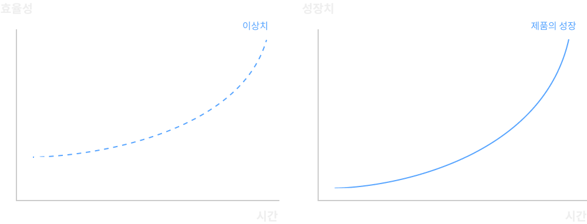
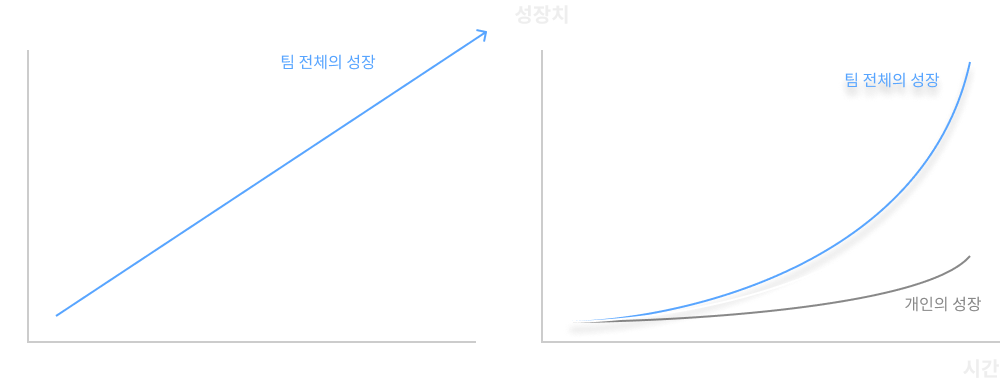
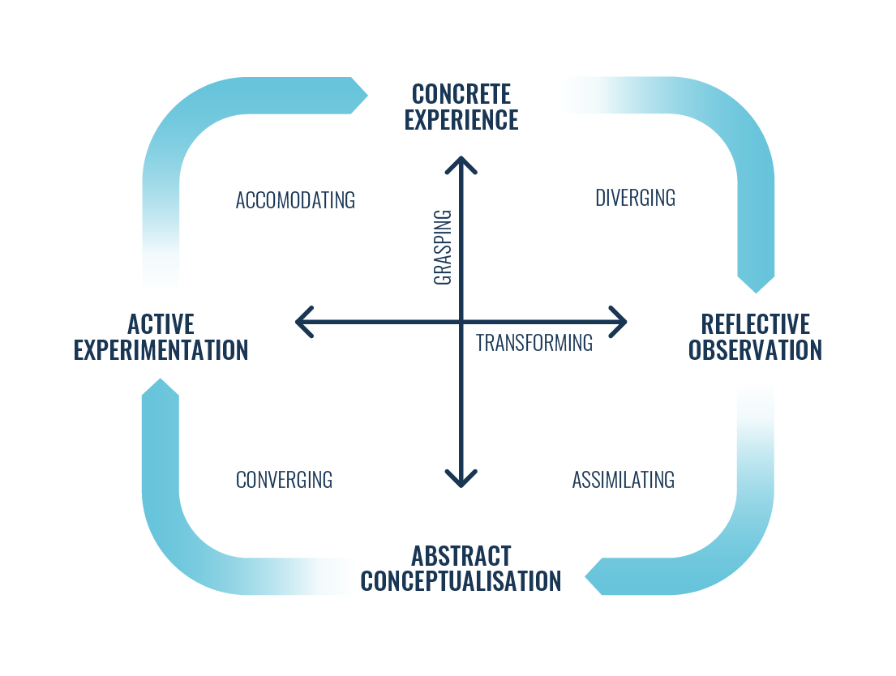
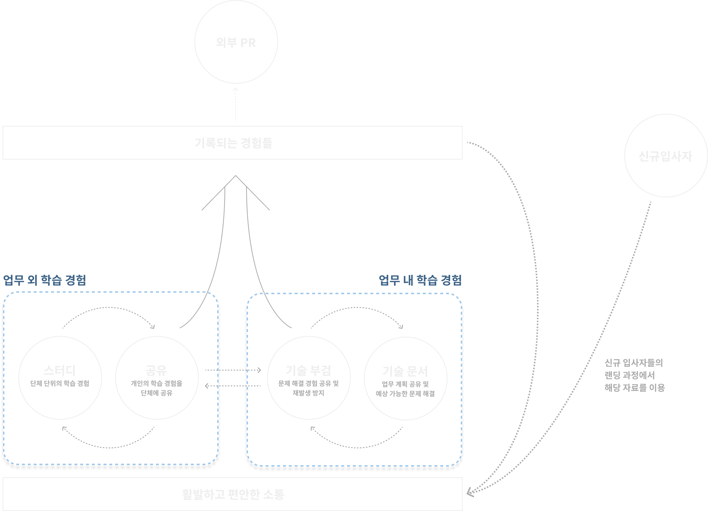

오래 근무하던 회사를 떠나 최근 작은 팀으로 이직하였습니다. 오랜만에 스타트업같은 스타트업에 다녀서 그런지 앞으로 해 나가야 할 것이 많다는 사실에 설레기도 합니다.

제가 지난 기간동안 회사의 볼륨이 크게 증가하는 경험을 하면서, 아쉬웠던 부분들을 이 회사에서는 반복하고 싶지 않았습니다. 그래서 어떤 사항을 고려하며 팀 문화를 만들어나가고 싶은지 전달할 필요가 있었고, 그렇게 작성하다 보니 블로그 글로 만드는게 좋을 것 같아 이렇게 글을 남깁니다.

이 글에는 몇가지 핵심 가정과, 제가 달성하고자 하는 팀의 목표가 있습니다. 즉, 이 글은 이 “핵심 가정”에 동의하고, 이 “목표”를 달성하고 싶으신 분들에게만 해당되는 이야기일 것입니다. [^1]

[^1]: 매우 편협한 서술 방식이라는 사실에는 동의합니다만, 왜 이런 가정을 하게 되었는지부터 서술하려면 하나 내지는 두개의 글을 더 쓸 수 있을듯한 기분입니다. 기회가 된다면 다음에 이유에 대해서 적어보겠습니다.

핵심 가정은 다음과 같습니다.

1. 사람은 부족하다
2. 사람은 앞으로도 부족할 것이다
3. Silver-Bullet은 없다 [^2]
4. 초기 스타트업에서 가장 중요한 것은 빠른 의사결정과 실행이다

[^2]: 미국의 유명한 격언입니다. 한국어로 표현하자면, 그 문제를 해결할 수 있는 완벽한 무언가는 없다는 의미입니다. 당연해 보이지만, 생각보다 Silver-bullet을 찾는 모습이 많이 보입니다. “시니어가 오면 해결될 것이다.” 이런 말처럼 말이죠. 하지만 연구결과에 따르면 주니어든 시니어든 새로운 도메인에서 기존 퍼포먼스를 찾기까지는 2년이라는 시간이 걸립니다. 김창준님 글에서 봤는데, 레퍼런스를 못 찾겠네요. 추후에 추가해 두겠습니다.

그리고, 목표로 하는 사항은 다음과 같습니다.

1. 성공적인 프로덕트를 만드는 것
2. 효율적으로 일하는 것
3. 프로덕트의 성장 속도와 함께 성장하는 것
4. 하나의 스포츠팀[^3]처럼 일하는 것

[^3]:
    팀스포츠 경기를 보시나요? 축구, 야구, 농구, 배구, 미식축구. 각자 규칙은 다르지만 하나 공유하는 것이 있습니다. 팀의 승리를 위해서 각자 맡은 자리에서 최선을 다하는 것입니다.\
    \
    이는 생각하면 매우 당연한 말처럼 들립니다. 다만 실제는 이것보다 더 복잡합니다. 축구에서 수비수가 방어를 위해 움직여 자리를 비우면 미드필더와 공격수가 자리를 메꾸고, 야구에서 아웃을 잡기 위해 중간에 송구하는 공을 받아 다시 전달해 주는 행위 등. 유기적으로 하나의 목표를 향해 움직이는 단체가 바로 스포츠 팀입니다.\
    \
    스포츠 팀처럼 일하는 것이란 바로, 하나의 목표를 공유하며, 유기적으로 할 수 있는 일을 하며 목표 달성을 위해 일하는 것입니다. 회사의 규모에 따라 적합한 형태가 달라지겠지만, 대부분의 초기 스타트업에서는 이러한 마음가짐이 중요하다고 믿습니다.

---

# 문제가 되는 상황들

팀이 셋업 된 후, 시간이 지남에 따라 점점 효율적인 팀의 운영과 개개인의 성장을 바랍니다. 이상적인 그래프라면 아래 그래프처럼 우상향해야 하지만, 실제 그래프를 그려보면 다음과 같은 결과가 많이 일어나곤 합니다.

왜 이런 현상이 일어나게 될까요? 단순 문서와 구두로 대화하여 그때 그때 합의를 이끌어 내기에는, 제품의 복잡성과 논의해야 할 팀원의 수가 기하급수적으로 증가하기 때문입니다. 2명인 팀에서 1명만 새로 추가되더라도 50%의 상승률을 보입니다.[^4]

[^4]: 팀이 늘어나서 모수가 줄어든다면 비율도 줄어듭니다. 하지만, 그 때는 추가 인원의 비율을 걱정해야 하는 것이 아닌 그냥 많은 수의 팀원을 걱정해야 하는 시기일 것입니다.

초기 스타트업에서는 정해진 사항이 아무것도 없기 때문에 당연히 모두가 헤메입니다. 각자 가진 의견을 주장하며 첨예하게 대립합니다. 의견의 합치는 어려운 일이지만, 누군가가 잠시 주장을 포기하던, 아니면 극적인 타협을 성공하든, 오랜 시간 후에 결론이 나옵니다. 자! 이제 개발만 하면 끝이겠지? 모두 기대에 차오릅니다.

슬프게도 그런 일은 없습니다. 논의 결과와 실제 모두가 이해한 방향으로 이행되는 것은 또 다른 이야기입니다. 일을 하다 보면 자신이 이해하고 설명한 생각과 다른 방식으로 이해한 상태에서 업무가 이미 진행되어 곤경을 겪으신 적이 있을 것입니다. 개인이 이해하는 방식은 어느 하나로 규정할 수 없기 때문에, 준비되지 않은 팀이라면 합의를 이루어내는 과정에서 많은 시간을 소모할 수 밖에 없습니다.

그렇다면 개인의 성장은 어떨까요? 저는 성장하는 회사에서 개인은 회사에 크기에 맞게 성장할 수밖에 없다고 생각합니다. 프로덕트가 성장해 나가는 각 과정에서 필요한 지식은 변화하기 때문에, 그 문제를 해결하기 위해서는 꾸준히 배우고 성장해 나가야 합니다.

다만 위에서 그린 그래프처럼, 제품의 성장과 개인의 성장이 언제나 일치하지는 않습니다. 그러나 각 팀원이 엄청나게 많은 추가 시간을 들여서 개인의 성장에 맞춰나가기 위해서 노력하는 것은 그리 효율적이지 않습니다. 같은 문제를 해결하기 위해 모인 팀에는, 이미 경험해 본 사람들이 분명히 있을 것이고, 이러한 사람들과의 대화를 통해 스스로 학습했을 때 들여야 할 많은 시간이 줄어듭니다.[^5]

[^5]: 유대인들은 이러한 학습법을 전통적으로 도입했으며, 이러한 학습법을 하브루타(havruta)라고 합니다. 연구 결과에 따르면 기존 주입식 학습법보다 14배 높은 결과로도 이어진다고 합니다.

---

# 해결책은 없는가?

제가 서술한 핵심 가정처럼, 도입했을 때 이 모든 문제를 완벽하게 해결해 줄 만한 해결책, 즉 Silver Bullet은 없습니다. 다만 조금 번거로울지라도 목표에 최대한 다가설 수 있는 방법은 있다고 생각합니다. 그 해결책은 바로, **“최대한 많이 대화하기"** 입니다.

오버 커뮤니케이션이라는 말이 있습니다. 필요 없는 정보에 대해서 공유하는 것을 일컫는 말입니다. 오버커뮤니케이션이 아주 위험한 예시처럼 언급되는 경우가 많지만, 개인적인 생각으로는 단어 자체가 허상이라고 생각합니다. [^6] 방향성이 잘못 설정된 대화가 있을지는 몰라도, 방향성이 맞는 모든 커뮤니케이션은 절대 오버할 수 없습니다.

[^6]: 지금 생각해보면 마이크로매니징과 혼동하는 경우도 있을 거 같네요. 명확히 말씀드리자면, 저는 마이크로매니징은 생산성에 방해된다고 생각합니다.

## 왜 오버커뮤니케이션은 존재하지 않을까?

같은 정보를 받아들이더라도, 모두가 이해하는 방식이 다르기 때문입니다. 모든 팀원이 이러한 지식을 최대한 같게 만들기 위해서 할 수 있는 유일한 방법은 바로 대화입니다.

그러나, 실제 업무 과정에서 빠른 의사결정과 실행에 방해가 되는 것은 아이러니하게 대화입니다. 그 이유는 대화 중 많은 시간을 과거에 이미 합의했다고 착각했지만 실제로는 그렇지 않아 다시금 합의하는 것에 사용하기 때문입니다. 이것이 문제를 해결해야 하는 회의 시간의 대부분을 차지하지만 실제로 문제 해결에는 ( 그 즉시 ) 도움되지 않는 경우도 많기에 회의 참석자 대부분이 피로감을 느끼는 결과가 됩니다. 이러한 수치를 저는 엔트로피 (무질서도) 라고 표현합니다.

과거 경험을 잠시 떠올려 보겠습니다. 당시 하나의 백엔드 저장소를 보고 있던 팀원은 모두 7명이었습니다. 그렇게 많은 수는 아니기 때문에 쉽게 합의에 도달할 수 있었을 것으로 생각했지만, 문제는 이러한 논의가 시작된 시점은 이미 개발팀이 제대로 셋업되고 3년 반이 지나있던 상태였다는 것입니다. 그간 팀 내부에서 제대로 된 컨센서스가 갖춰진 적이 없었고, 그 결과 이미 손 쓸수 있는 범위를 벗어난 것입니다. 결국 제대로 된 문제 개선을 할 수 없었습니다.

이러한 문제는 초기부터 꾸준하게 자주 대화함으로써 적은 비용[^7]으로 해결할 수 있습니다. 개개인은 부족한 부분을 이해하고 다른 팀원들과 점진적으로 효율적인 소통을 할 수 있습니다. 이러한 효율적인 스타일에는 개인의 화법을 이해하는 것, 각자가 가진 지식을 이해하는 것, 각자의 업무 도중에 문제되는 것들을 고려하는 것 모두 포함될 수 있습니다. 위에서 언급했듯, 같은 정보를 받아들이더라도, 모두가 이해하는 방식이 다르기 때문입니다. 모든 팀원이 이러한 지식을 최대한 같게 만들기 위해서 할 수 있는 유일한 방법은 바로 대화입니다.

[^7]: 적은 비용이라고 표현했지만 절대적 비용은 전혀 작지 않을 수 있습니다! 방치한 팀이 커졌을 때와 비교했을 때 상대적으로 작다는 의미입니다.

앞서 서술한 대화들은 본인이 직접 겪거나, 다른 이들에게 들어서만 알 수 있는 정보입니다. “프론트엔드 개발자가 API Call하는 게 불편하다" 나 “디자이너가 구체화하기에는 UX Flow가 빈약하다" 등의 정보는 신의 계시처럼 하늘에서 내려오지 않습니다.

## 그렇지만 현실은

매우 이상적인 이야기지만 실제로 이루어지는 것은 잘 보지 못했습니다. 왜냐하면 사람의 대화에는 엄청나게 많은 정보가 담겨 있고, 각자가 그 중 어느 정보를 최우선으로 생각하는지는 너무나도 다르기 때문입니다. 연인과의 관계에서 어느 누구는 말보다 행동이 중요하지만, 어느 누구는 좋은 말 또한 중요하게 여기는 것처럼요.

또한 실제로 그런 마음이 아니었더라도- 다른 이들에게 곡해되어 전달되는 이야기들도 있을 것입니다. 거절의 두려움이 있는 사람도 있겠지요. 이러한 여러 오해와 거절이 쌓이게 되면 대부분의 사람들은 이러한 대화 자체를 멀리하게 됩니다.

저는 개인적으로 이러한 회피를 진통제와 같은 것이라고 봅니다. 지금 당장은 내가 편할지는 몰라도, 마주한 문제를 해결하려는 목표에는 다가설 수 없습니다. 저도 사람인지라 이러한 회피와 거절을 선호하진 않습니다. 하지만 어떡합니까? 문제를 해결하려면 결국 그 문제를 들여다보아야 합니다. 그렇지만, 최대한 안 아프게 상처를 들여다보고 해결할 수는 없을까요?

## 컨센서스가 갖추어진 대화의 힘

친구들 이야기를 잠시 꺼내 보겠습니다. 저와 제 친구들 철수, 영희, 바둑이(가명입니다)는 모두 고등학교 동기들입니다. 지금도 가장 친한 친구들이라고 소개하곤 하는데요. 컴퓨터를 자주 다루는 고등학교를 나온지라, 고등학교 친구들과 서비스를 개발하는 일이 자주 있었습니다. 지금 제 나이를 생각해본다면 10년정도 호흡을 맞춘 친구들이 되겠네요.

그 친구들과 개발을 위해 대화하는 과정을 살펴보면, 대화가 어떠한 형식을 갖추었는지는 전혀 중요하지 않습니다. 가장 중요한 문제를 공유하고, 그 문제를 해결하기 위해 대화를 나눕니다. 그 과정에서 나쁜 아이디어라며 거절도 자주 당하고, 제시하는 해결 방향이 많아 첨예하게 대립하기도 하지만 서로 기분 나빠하지 않습니다. 모두가 “문제 해결이 제일 중요하고, 우리는 서로에게 상처주려는 의도로 말하지 않는다" 라는 컨센서스가 모두에게 존재하기 때문입니다. 이렇게 나눈 대화의 끝에는 결과물이 있고, 그리 길지 않은 시간에 결론이 나오게 됩니다.

이러한 합의가 확장된다면, 문제를 해결하기 위한 정보를 다른 이들에게 공유하는 행위가 매우 자연스러워집니다. 또한 다른 이들의 문제를 같이 해결해 주기도 하면서 다양한 문제 상황에 대해 학습할 수 있습니다. 이러한 과정에서 문제 해결 외의 다른 것에 집중할 필요는 없습니다. 다른 문제에 대해서는 합의가 이루어져 있기 때문입니다. 이러한 합의를 이룸으로써 목표 달성을 위해서 함께 노력하는 하나의 스포츠 팀 같은 형태에 한 발짝 다가설 수 있습니다.

---

# 학습하며 성장하는 팀

다시 위에서 사용했던 이미지를 가져와 보겠습니다. 글의 앞 부분에서는 주로 업무의 효율성을 위해 대화의 컨센서스를 이야기했습니다. 하지만, 이렇게 컨센서스가 갖추어진 대화는 한가지 큰 장점이 있습니다. 바로 서로가 서로의 성장에 도움이 될 수 있다는 것입니다. 그리고 이는 앞서 말했던 컨센서스가 갖추어딘 활발한 소통을 기반으로 합니다.

우리가 바라는 것은 오른쪽 그래프처럼 제품의 성장을 따라가거나, 함께 성장할 수 있는 팀을 만드는 것입니다. 모두가 한번에 같은 방향으로 성장하기 보다는, 각자가 더욱 강점이 있는 분야에 대해서 조금 더 빠르게 학습하고, 팀원들과 서로 공유하며 인사이트를 얻어가는 방식으로 학습하는 것이 급격히 성장하며 여유가 없는 팀에게는 조금 더 적합한 모델일 것입니다.

## 활발한 소통을 바탕으로 한 상호 보완적 발전

이러한 경험을 이용해서, 작은 스타트업이 갖는 필연적인 시간적 한계에도 불구하고 학습할 수 있는 방법을 생각해 보았습니다. 앞서 서술한 컨센서스에 대해 강조한 이유는, 이러한 사이클을 만들어내기 위한 기초이기 때문입니다. 최대한 업무에 가깝게, 효율적으로 학습해야 하므로 그 관점으로 생각해 보겠습니다.

### 업무 내의 학습

업무를 하는 도중에도 분명 학습할 지점이 있을 것입니다. 하나의 업무 사이클 (기획 → 개발 → QA → 배포 → 회고) 에서 학습하는 지점이 되는 기획 / 회고 문서를 작성하는 것이 그 예시가 될 수 있습니다.

뿐만 아니라, 장애 상황에 대해서 원인을 파악하고 대응 방법 그리고 개선 사항에 대해 정리하는 기술 부검 문서도 하나의 예시가 될 수 있습니다. 이런 식의 경험은 팀을 성장시킨다고 생각하지만, 정확히는 팀이 아닌 개개인을 성장시키는 경험입니다. 대부분의 경우 공유되지 않고 넘어가기 때문입니다.

이런 경험을 팀 전체의 학습으로 전환시키기 위해, 이런 문제 상황에 대해서 주기적으로 공유하는 세션을 가지고, 위에서 나온 모든 예시들을 적절히 문서화함으로써 팀 전체의 학습 경험으로 전환할 수 있습니다.

### 업무 외의 학습

개인적으로 업무시간 외에 시간을 들여서 다양한 프로젝트나 학습을 진행하는 편입니다만, 이런 행위를 다른 사람들에게 강요할 수는 없습니다. 다만, 이렇게 학습한 내용들을 다른사람에게 자주 공유함으로써 개인의 학습 행위를 팀의 학습으로 확장시킬 수는 있습니다.

이러한 경우 팀 내부의 발표 세션 등을 예시로 들고, 이는 좋은 예시라고 생각합니다. 다만, 성장하는 팀에 있어서 조금 더 효율적인 방법이 없을까 고민해 본 결과 다른 좋은 방법이 생각났습니다. 바로 자연스럽게 대화 주제를 학습할 수 있는 영역으로 옮기는 것입니다.

다시한번 저와 철수, 영희 그리고 바둑이 이야기를 해 보겠습니다. 앞서 말했듯이 상호간의 컨센서스가 갖추어진 저희는 자주 관심분야인 개발과 팀 운영 그리고 생산성 등에 대해 이야기를 나누곤 합니다. 다만 각자가 속해있는 도메인은 다르기에, 저희의 대화 주제는 각자 기본적인 지식들을 공유하지만 모두 잘 아는 분야에 대해서 이야기하는 것은 아닙니다.

이런 상황에서 모두가 컨센서스를 공유하기에, 업무 도중에 느꼈던 경험들이나 생각난 아이디어들을 쉽게 공유합니다. 또한 그 주제로 또 다른 다양한 아이디어 그리고 기존에 본인이 갖고 있던 지식을 공유합니다. 이 과정을 통해서 별도의 학습 과정 없이도 다른 이의 인사이트를 얻을 수 있습니다. 저와 대화를 나누는 이들도 마찬가지일 것입니다.

### 전체 다이어그램

모든 학습 과정은 단방향이 아닙니다. 기존에 학습한 내용을 토대로 다른 지식을 붙혀나가는 순환 과정입니다[^8]. 이 점을 고려했을 때, 전체 팀의 학습 사이클 역시 순환되는 과정이어야 할 것입니다. 위에서 언급한 모든 과정을 하나의 사이클로 엮고, 그 부산물들을 외부 PR이나 신규입사자 랜딩 등 적재적소 필요한 곳에 사용하는 방법으로 효율성을 높여 보았습니다.

[^8]:
    콜브의 학습 사이클에 의하면, 학습은 다음과 같은 사이클을 이룹니다. 저는 이 사이클 관점에 매우 동의합니다. \
    

그 결과는 다음과 같은 그래프입니다.

# 결론

저는 개인의 업무 경험, 학습 경험 그리고 다양한 산출물들이 매우 유기적으로 연결되어 있다고 생각합니다. 물리적인 시간이 절대적으로 부족한 스타트업에서, 모든 경험을 학습의 영역으로 포함할 수 있다면, 폭발적으로 성장하는 팀과 프로덕트를 만들 수 있을 것이라 생각합니다. 이러한 아이디어가 도움이 되기를 기원합니다.
