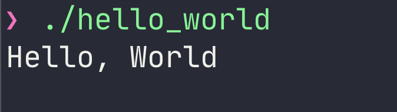

Hello World를 출력하는 것은 매우 쉽지만, 코드가 어셈블리어로 작성되었다면 이야기가 다르다. 최근 진행하는 스터디 내용을 더욱 잘 이해하기 위해서 어셈블리를 찾아보고 있는데, 봐도 이해가 잘 안되어서 뜯어 보기로 했다.

해당 실습은 MacOS 10.15.4 ( Catalina ) 에서 진행되었다.

<script src="https://gist.github.com/juungbae/c95ae2e5921d87e9460bd0aba8992ecd.js"></script>

### `global` : 특정 심볼을 global로 정의

어셈블리에서는 기본적으로 모든 코드가 private이다. 이때 다른 모듈이 해당 코드에 접근할 수 있게 하기 위해서 global instruction을 이용하여 심볼에 다른 코드가 접근할 수 있도록 해 준다. 이렇게 명시하지 않는다면 링커에서 아무런 심볼을 찾을 수 없다는 오류가 발생한다.

### `section` : 섹션을 정의

섹션을 정의하는데, `.text` 섹션은 일반적으로 읽기 전용 \***\*코드, 즉 **실행 가능한 코드\*\*가 들어간다. 실제로 IA32e ( Intel의 x86-64 모드 ) 에서는 해당 섹션은 수정할 수 없다.

위 정보를 토대로, 우리는 `start` 심볼 안에 있는 코드가 Hello World를 출력할 것을 유추할 수 있다.

# `_main` 심볼의 코드 톺아보기

```assembly
_main:
    mov rax, 0x02000004
    mov rdi, 1
    mov rsi, message
    mov rdx, 13
    syscall
    mov rax, 0x02000001
    xor rdi, rdi
    syscall
```

뭔가 `syscall` 명령어를 기점으로 나뉘는 거 같으니, `syscall` 이 무엇인지 알아보자.

## 📞 System Call

우리가 작성하는 프로그램은 사용자 공간에서 작동하는데, 해당 공간에서는 특정한 명령어 실행이 불가능하다. 이 때 파일 입출력과 같이 우리가 원하는 동작을 수행하기 위해서는 커널에 의존하여야 한다. 이 때 커널에 원하는 요청을 제공하는 방법을 system call이라고 한다.

우리가 하고자 하는 **콘솔 창 출력** 또한 system call을 이용해야 한다. Mac OS x86-64의 System Call 테이블은 [다음](https://github.com/opensource-apple/xnu/blob/master/bsd/kern/syscalls.master)과 같은데, 우리가 써야 하는 건 `sys_write` 와 `sys_exit` 이 두가지이다.

```c
1	AUE_EXIT	ALL	{ void exit(int rval) NO_SYSCALL_STUB; }
4	AUE_NULL	ALL	{ user_ssize_t write(int fd, user_addr_t cbuf, user_size_t nbyte); }
```

`syscall` 명령은 현재 레지스터에 담겨 있는 값을 토대로 알맞은 system call을 호출한다.

## ☝️ 첫번째 System call, 출력

```assembly
    mov rax, 0x02000004
    mov rdi, 1
    mov rsi, message
    mov rdx, 13
    syscall
```

### sys_write 식별자 지정

우리가 가장 먼저 실행하고자 하는 system call은 `write` 이고, 이는 4라는 식별자를 갖고 있다. 어떤 system call을 실행할 지는 `%rax` 레지스터를 참조하기 때문에 `%rax` 에 **0x0200004** 값을 넣어준다. ( Mac OS에에서는 식별자에 0x02000000 를 더해 주어야 한다 )

### File Descriptor 지정

콘솔 창 출력 ( STDOUT )을 하고 싶으므로, POSIX FD에 의거하여 값 1을 지정한다. 첫번째 매개 변수로는 `%rdi` 를 사용한다.

### Buffer와 크기 지정

Hello, World를 출력하고 싶으므로 "Hello, World" 값을 지정한다. 사이즈는 13을 지정한다. 두번째와 세번째 매개 변수로는 각각 `%rsi`, `%rdx` 를 사용한다.

### 나머지 매개 변수들은?

`%rcx` , `%r8` , `%r9` 등이 각각 4번째, 5번째, 6번째 매개변수로 이용된다.

이렇게 필요한 값을 지정 레지스터에 저장한 후 `syscall` 을 호출하면 Hello, World 를 출력한다.

## ✌️ 두번째 System call, 종료

```assembly
    mov rax, 0x02000001
    xor rdi, rdi
    syscall
```

Exit 0을 하고 싶으므로, **sys_exit** 식별자를 `%rax` 에 추가한 후 `%rdi` 를 0으로 만들어 주는 코드이다.

# 🏃 실행하기

하여 완성된 코드는 다음과 같다. 위에 코드와 동일하지만 올라가기 귀찮으니 한번 더 보여주는 것이다.

<script src="https://gist.github.com/juungbae/c95ae2e5921d87e9460bd0aba8992ecd.js"></script>

다음과 같은 쉘 명령어를 이용해 해당 코드를 object 파일로 만들 수 있다. 우리는 Mac OS 64비트 운영체제이므로 `-f` 를 이용해 `macho64` 를 지정하여 준다.

```bash
> nasm -f macho64 hello_world.asm
```

이 명령어를 이용하면 `hello_world.o` 목적 파일이 생성된다. 이 파일을 실행 가능한 파일로 만들기 위해서는 링크 과정이 필요하다.

```bash
> ld -lSystem hello_world.o -o hello_world
```

이 명령어를 이용하면 원활히 실행 가능하다.
